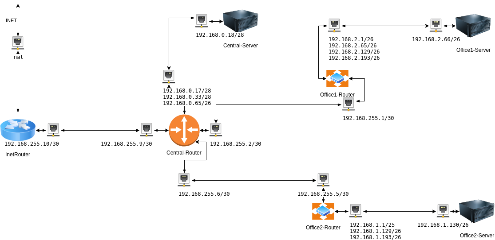

## base routing
Исходные данные:
# Планируемая архитектура
построить следующую архитектуру

Сеть office1
- 192.168.2.0/26 - dev
- 192.168.2.64/26 - test servers
- 192.168.2.128/26 - managers
- 192.168.2.192/26 - office hardware

Сеть office2
- 192.168.1.0/25 - dev
- 192.168.1.128/26 - test servers
- 192.168.1.192/26 - office hardware


Сеть central
- 192.168.0.0/28 - directors
- 192.168.0.32/28 - office hardware
- 192.168.0.64/26 - wifi

```
Office1 ---\
-----> Central --IRouter --> internet
Office2----/
```
Итого должны получится следующие сервера
- inetRouter
- centralRouter
- office1Router
- office2Router
- centralServer
- office1Server
- office2Server

# Теоретическая часть
- Найти свободные подсети
- Посчитать сколько узлов в каждой подсети, включая свободные
- Указать broadcast адрес для каждой подсети
- проверить нет ли ошибок при разбиении

# Практическая часть
- Соединить офисы в сеть согласно схеме и настроить роутинг
- Все сервера и роутеры должны ходить в инет черз inetRouter
- Все сервера должны видеть друг друга
- у всех новых серверов отключить дефолт на нат (eth0), который вагрант поднимает для связи
- при нехватке сетевых интервейсов добавить по несколько адресов на интерфейс

### Решение
H - количество хостов в подсети
```
office1Router		H	Broadcast
192.168.2.0/26	dev	62	192.168.2.63
192.168.2.64/26	test servers	62	192.168.2.127
192.168.2.128/26	managers	62	192.168.2.191
192.168.2.192/26	office hardware	62	192.168.2.255
```
```
office2Router		H	Broadcast
192.168.1.0/25	dev	126	192.168.1.127
192.168.1.128/26	test servers	62	192.168.1.191
192.168.1.192/26	office hardware	62	192.168.1.255
```
```
centralRoter		H	Broadcast
192.168.0.0/28	directors	14	192.168.0.15
192.168.0.32/28	office hardware	14	192.168.0.47
192.168.0.64/26	wifi	62	192.168.0.127
			
192.168.0.16/28	FREE	14	192.168.0.31
192.168.0.48/28	FREE	14	192.168.0.63
192.168.0.128/25	FREE	126	192.168.0.255
```
Для транспорта использовал  подсети:
```
192.168.255.0/30 - Office1Router<>CentralRouter
192.168.255.4/30 - Office2Router<>CentralRooter
192.168.255.8/30 - CentralRoter<>InetRouter
```
Чтобы проверить решение, необходимо:

1. Скачать Vagrantfile, каталог files, каталог files со всем его содержимым должен лежать рядом с Vagranfile
2. Выполнить vagrant up  в том каталоге, куда скачали Vagrantfile и каталог files в п.1.
После старта создаться 7 инстансов, согласно нижеприведенной схеме. 

Схема сети
