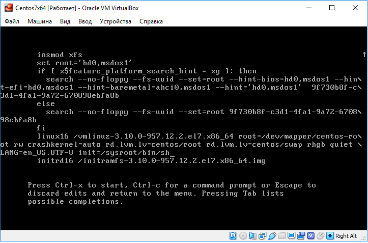
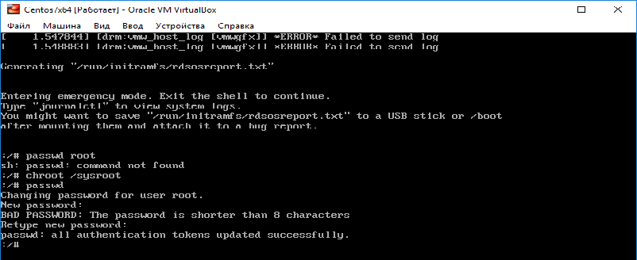
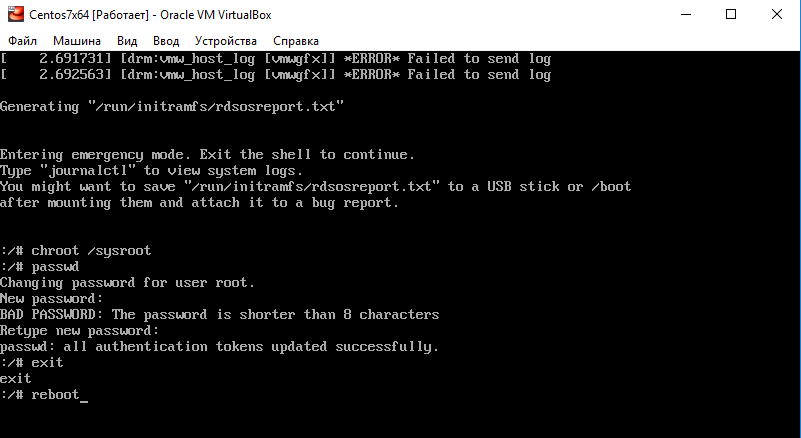
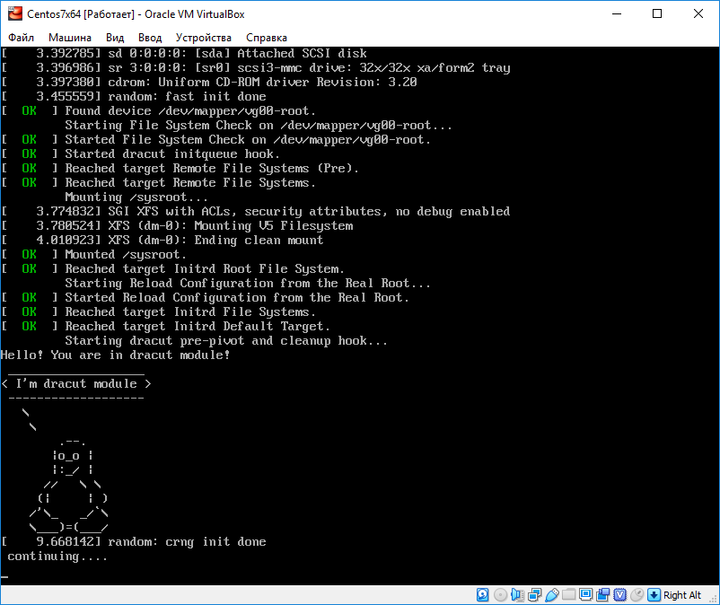

## Попасть в систему без пароля несколькими способами

1. rd.break

    1.1. При загрузке, когда бут меню CentOS, жмем e, стрелкой вниз листаем до *linux* или *linux16* или *linuxefi*, зависит от вашей инсталляции. Меняем параметр *ro* на *rw*, в конце строки добавляем rd.break enforcing=0 и жмем ctrl+x
    
    1.2. Когда прогрузились в emergency mod делаем:
      - chroot /sysroot
      - passwd root
      - touch /.autorelabel
      - exit
      - reboot
    
2. Подмена /sbin/init
    2.1.  При загрузке, когда бут меню CentOS, жмем e, стрелкой вниз листаем до *linux* или *linux16* или *linuxefi*, зависит от вашей инсталляции. Меняем параметр *ro* на *rw*, в конце строки добавляем init=/sysroot/bin/sh. Можно конечно просто добавить init=/bin/sh, а потом перемаунт из RO в RW делать, но зачем, если сразу можно быстро и без лишних теледвижений после бута попасть куда надо и сделать что надо? Жмем ctrl+x
    
    После загрузки в emergency mod, набираем:
     - chroot /sysroot
     - passwd
    Вводим пароль root два раза и затем:
     - exit
     - reboot
     
3. init=1
    3.1.  При загрузке, когда бут меню CentOS, жмем e, стрелкой вниз листаем до *linux* или *linux16* или *linuxefi*, зависит от вашей инсталляции. Меняем параметр *ro* на *rw*, в конце строки добавляем init=1. Жмем ctrl+x Система будет в emergency mod, но в режиме записи.
    
    После загрузки в emergency mod, набираем:
     - chroot /sysroot
     - passwd
    Вводим пароль root два раза и затем:
     - exit
     - reboot
     
RD.BREAK недоступен для CentOS 5 и 6, но вот init=1 удобнее и быстрее вписать и работает в CentOS 7

## Система с boot в LVM
1. Исходные данные:
```
lsblk -f
NAME            FSTYPE      LABEL UUID                                   MOUNTPOINT
sda
├─sda1          xfs               9f730b8f-c3d1-4fa1-9a72-670898ebfa8b   /boot
└─sda2          LVM2_member       4Qe9iq-qrS8-3MwQ-kffR-L6Kt-TywS-3jcP5t
  ├─centos-root xfs               a500c765-d078-4c22-945d-c3ef835003b4   /
  └─centos-swap swap              1ff3cafe-b7bf-4883-9eb1-2434d049cac5   [SWAP]
```
2. Действия:

    2.1. Добавляем диск такого размера, чтобы хватило на /boot + / + swap
    2.2. Инициализируем PV на добавленном диске c опцией для boot
    ```
    pvcreate /dev/sdb  --bootloaderareasize 1m
    ```
    2.2. Создаем vg
    ```
    vgcreate vg01 /dev/sdb
    ```
    2.3. Создаем LV и файловую систему на них
    ```
    lvcreate -L 1024M vg01 lv_swap
    lvcreate -l100%FREE vg01 lv_root
    mkswap /dev/vg01/lv_swap
    mkfs.ext4 /dev/vg01/lv_root
    ```
    2.4. Монтируем новый рут в mnt
    ```
    mount /dev/vg/01/lv_root /mnt
    ```
    2.5. Создаем директорию /mnt/boot и синкаем /boot в /mnt/boot и /  в /mnt/
    ```
    rsync --progress -av /boot/* /mnt/boot
    rsync -axu --exclude '/mnt/*' --exclude '/boot' / /mnt
    ```
    2.6. Делаем бинды для chroot и потом chroot`имся
    ```
    mount -o bind /dev/ /mnt/dev
    mount -o bind /sys /mnt/sys
    mount -o bind /proc /mnt/proc
    mount -o bind /run /mnt/run
    chroot /mnt
    ```
    2.7. Выключаем selinux, чтобы не обломаться потом с входом в систему:
    ```
    vi /etc/selinux/config
    SELINUX=permissive
    ```
    2.8. Добавляем репо с пропатченным grub и инсталлим его
    ```
    vi /etc/yum.repos.d/patchedgrub.repo
    [patchedgrub]
    name=patchedgrub
    baseurl=https://yum.rumyantsev.com/centos/7/x86_64/
    enabled=1
    yum install grub2 -y --nogpgcheck
    ```
    2.9. Правим fstab и grubconfig
    ```
    vi /etc/default/grub
    GRUB_TIMEOUT=5
    GRUB_DISTRIBUTOR="$(sed 's, release .*$,,g' /etc/system-release)"
    GRUB_DEFAULT=saved
    GRUB_DISABLE_SUBMENU=true
    GRUB_TERMINAL_OUTPUT="console"
    GRUB_CMDLINE_LINUX="crashkernel=auto rd.lvm.lv=vg01/lv_root rd.lvm.lv=vg01/lv_swap  rhgb quiet"
    GRUB_DISABLE_RECOVERY="true"
    ```
    ```
     vi /etc/fstab
     /dev/mapper/vg01-lv_root /                       ext4     defaults        0 0
     /dev/mapper/vg01-lv_swap swap                    swap    defaults        0 0
    ```
    2.10. Далее я делал так:
    ```
    dracut  /boot/initramfs-$(uname -r).img $(uname -r) --force
    grub2-mkconfig -o /boot/grub2/grub.cfg && grub2-install /dev/sdb
    ```
    2.11. Выключаем машину, отцепляем первый диск, чтобы машина загрузилась со второго и вуаля:
    ```
     lsblk -f
    NAME           FSTYPE      LABEL UUID                                   MOUNTPOINT
    sda            LVM2_member       nrxXSL-yXBk-ZeRf-sgUp-itQb-WCYf-GxbqSE
    ├─vg01-lv_root ext4              169b06ca-94ae-4944-b1fe-d7293f9f3086   /
    └─vg01-lv_swap swap              0325aea6-a2c1-450b-a27a-c5e7f13b8bbd   [SWAP]
    ```
## Добавление модуля в dracut
Результат выполения работы:



